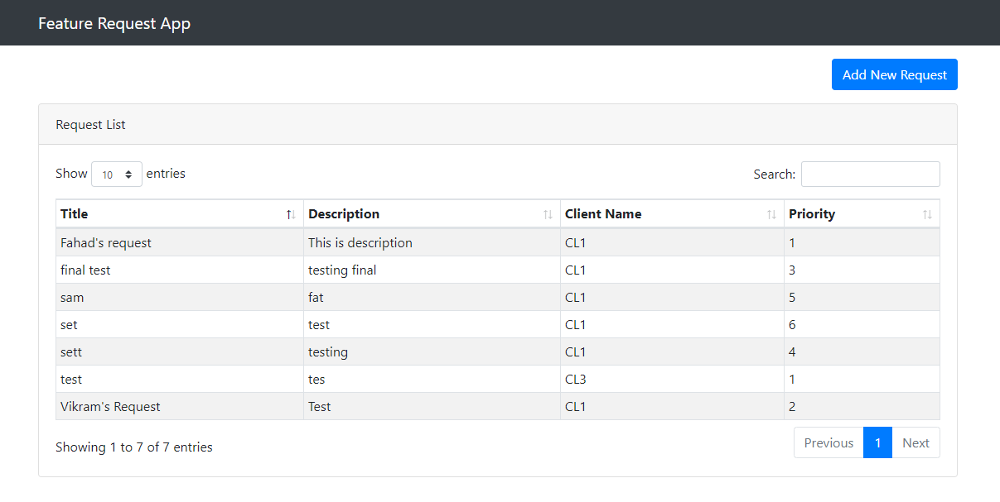

# Feature Request App
Feature Request App is a web application that can be used for creating a feature request that will be added onto an existing piece of software.

## Main Feature
The priority of a feature request is given by the client. Client Priority numbers should not repeat for the given client, so if a priority is set on a new feature as "1", then all other feature requests for that client should be reordered.
